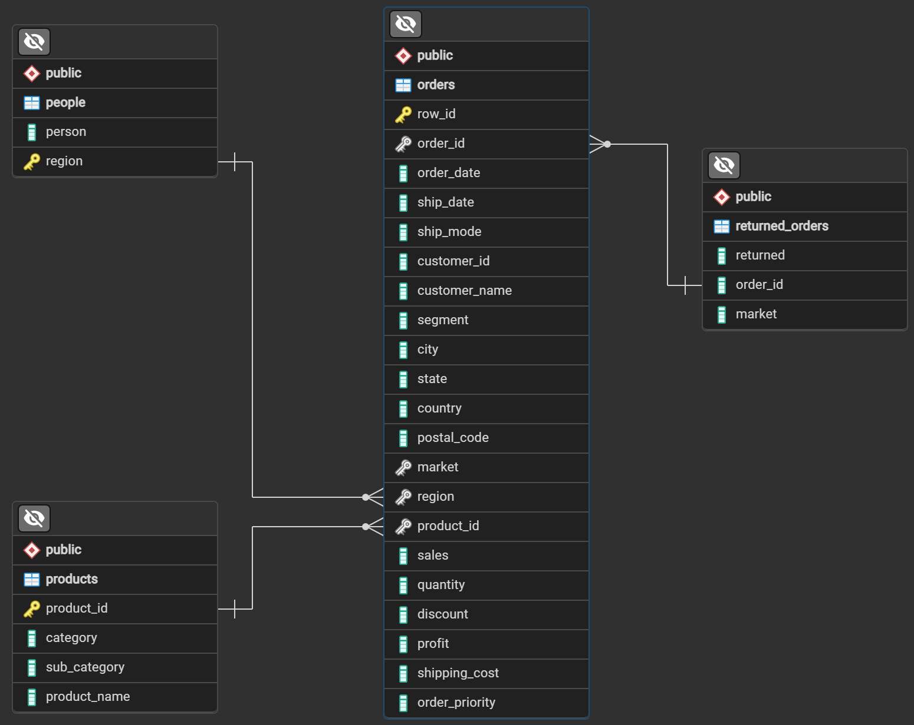

# Super Store Data Cleaning & Profitability Analysis

 

## 📌 The Business Problem
A hypothetical Super Store requires comprehensive data cleaning and analysis to optimize its sales strategy. This project focuses on identifying top-performing categories based on profit margins, detecting and imputing missing data values, and isolating the top-performing products within each category to drive inventory and marketing decisions.

## 🗃️ Data Dictionary
The analysis relies on relational data detailing daily transactions and returns. Below is the schema for the primary `orders` table utilized in this project:

| Column | Data Type | Description |
| :--- | :--- | :--- |
| `row_id` | INTEGER | Unique Record ID |
| `order_id` | TEXT | Identifier for each order in the table (Connects to `returned_orders`) |
| `order_date` | TEXT | Date when the order was placed |
| `market` | TEXT | Market the order belongs to |
| `region` | TEXT | Region the customer belongs to |
| `product_id` | TEXT | Identifier of the product bought |
| `sales` | DOUBLE PRECISION | Total Sales Amount for the line item |
| `quantity` | DOUBLE PRECISION | Total Quantity for the line item |
| `discount` | DOUBLE PRECISION | Discount applied to the line item |
| `profit` | DOUBLE PRECISION | Total Profit earned on the line item |

## 🛠️ Tools & Techniques
*   **SQL Dialect:** PostgreSQL / Standard SQL
*   **Querying Techniques:** Common Table Expressions (CTEs), `LEFT JOIN`, `GROUP BY`, Window Functions (Ranking), Data Imputation.
*   **Environment:** DataCamp Workspace / Jupyter Notebook (`.ipynb`)

## 🔬 Methodology
To ensure accurate profitability tracking, the raw data underwent rigorous cleaning and transformation:
1.  **Missing Value Imputation:** Utilized Common Table Expressions (CTEs) to isolate records with missing values and systematically imputed them to maintain dataset integrity without skewing profit metrics.
2.  **Relational Mapping:** Executed `LEFT JOIN` operations to connect the `orders` table with the `returned_orders` data, ensuring refunded or canceled items did not falsely inflate sales figures.
3.  **Profit Margin Aggregation:** Applied `GROUP BY` clauses to aggregate financial metrics and identify the most profitable product categories overall.
4.  **Top Product Ranking:** Extracted the top 5 performing products within each distinct category to provide granular inventory insights.

## 💡 Key Insights & Findings

*   **High Sales Do Not Always Equal Profitability:** There is a significant discrepancy between revenue and profit in certain categories. Most notably, in the Office Supplies category, the "Hoover Stove, White" ranks 2nd in total sales ($32,842.60) but actually resulted in a net loss, generating a negative profit of -$2,180.63. 
*   **Technology Drives the Highest Revenue and Margins:** The Technology category dominates top-line sales, with the top four products all being full-size smartphones (Apple, Cisco, Motorola, and Nokia), each exceeding $71,000 in total sales. Furthermore, the "Canon imageCLASS 2200 Advanced Copier" acts as a massive profit driver, generating $25,199.93 in profit alone.
*   **Successful Data Imputation Maintained Dataset Integrity:** Missing `quantity` values were successfully recovered by reverse-engineering a `unit_price` (calculated as Sales divided by Quantity) grouped by specific product, discount, market, and region dimensions. This CTE logic seamlessly calculated missing quantities (e.g., extracting exact quantities of 2.0, 3.0, and 4.0 for specific Furniture and Technology transactions) ensuring the final analysis was not skewed by incomplete records.

## 🚀 Strategic Recommendations

*   **Investigate Loss-Leading Products:** Immediately review the pricing, supplier costs, and discount structures for the "Hoover Stove, White." Because it has high sales volume but negative margins, adjusting its price point or reducing applied discounts could quickly turn a major loss into a profit center.
*   **Double-Down on High-Margin Tech:** Shift marketing and inventory budget toward the Canon imageCLASS Copier and the top-tier smartphone lines. These products offer the highest return on investment and should be heavily promoted in B2B or premium retail channels.
*   **Fix Upstream Data Collection:** While the missing values were successfully imputed using SQL, the business should implement automated data validation rules at the point-of-sale system to prevent NULL `quantity` fields from being recorded in the database moving forward.

---
## 💻 View the Code
You can view the full SQL queries, data cleaning steps, and analysis in the Jupyter Notebook here: 

[Click here to view the complete notebook.ipynb file](notebook.ipynb)
---
## 📬 Let's Connect
**John Fafiolu O.** | **Data Analyst** 

I specialize in transforming raw datasets into strategic business solutions using SQL, Python, R, and Excel. 
*   **LinkedIn:** [LinkedIn URL](https://www.linkedin.com/in/john-fafiolu-5475b3274/)
